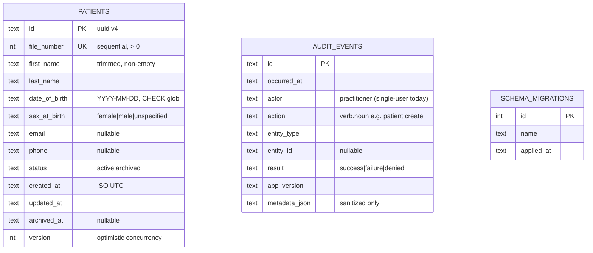
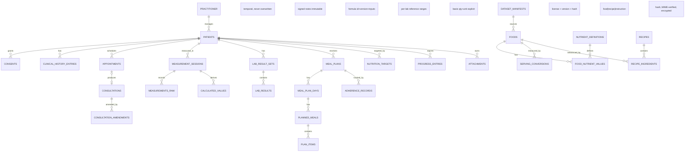

# Entity-Relationship Design

## Implemented today (migration 0001)

`audit_events.entity_id` intentionally has **no** foreign key to patients: audit history must survive entity deletion.

Indexes: `patients(last_name, first_name)`, `patients(status)`, `audit_events(entity_type, entity_id)`, `audit_events(occurred_at)`.

## Target model (Phases 2–6) — planning level

Design rules carried into every future migration:

1. Raw values and calculated values are separate tables; calculations carry formula id + version + inputs (reproducibility).
2. Nutrient values always carry basis quantity + basis unit + source + confidence; missing ≠ zero.
3. Signed consultations are immutable; changes are amendment rows with author/timestamp/reason.
4. Temporal clinical history: new rows supersede, never UPDATE-in-place.
5. Soft delete/archival distinct from irreversible deletion; deletion workflows record audit events.
6. Every dataset-derived row keeps `source_id`/`source_version` for provenance.
