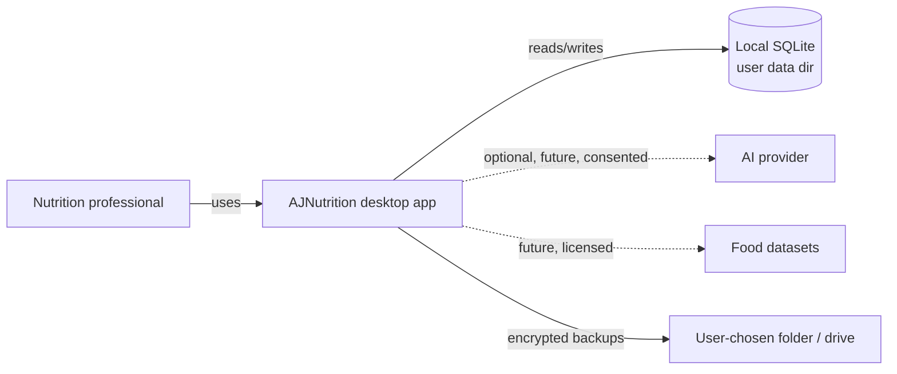
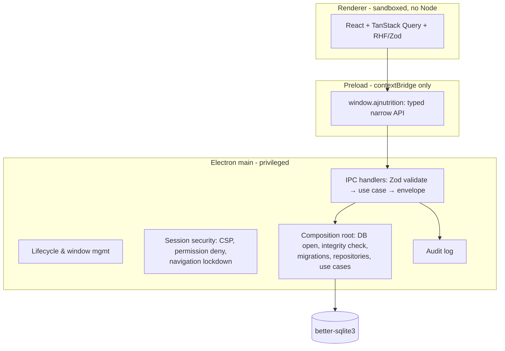

# Architecture Overview

Local-first modular monolith inside an Electron desktop app. One privileged main process owns the database and every side effect; the renderer is an unprivileged UI that can only call narrow, validated business capabilities.

## System context



Everything clinical works offline. The dotted paths are optional, explicitly identified internet features.

## Process model



Renderer flags: `nodeIntegration: false`, `contextIsolation: true`, `sandbox: true`, `webSecurity: true`. Preload exposes business methods only — never `ipcRenderer`, file paths, SQL, or shell access. Long-running work (PDF, imports, optimization) will move to utility processes when those features arrive.

## Packages and dependency rules

```text
apps/desktop/renderer → @ajnutrition/shared (contracts only)
apps/desktop/preload  → @ajnutrition/shared (channels + api type)
apps/desktop/main     → application + database + shared
@ajnutrition/database → application (ports) + domain + shared
@ajnutrition/application → domain + shared
@ajnutrition/domain   → shared (error type only); NO electron/react/sqlite/node
@ajnutrition/shared   → zod only
```

Enforced two ways: package.json dependency declarations (pnpm strict node_modules makes undeclared imports fail) and `no-restricted-imports` ESLint rules per layer. Future packages (`nutrition-engine`, `reporting`, `security`, `ai`, …) are created **when their phase starts** — no empty placeholder packages.

## IPC model

- Channel names live in one registry (`shared/src/ipc/channels.ts`).
- Every handler: sender-frame trust check → `schema.parse` (`.strict()`, unknown keys rejected) → synchronous use case → `IpcResult<T>` envelope.
- Errors: `AppError` with a stable code + Spanish-safe message + supportCode; Zod issues mapped to `fieldErrors`; unknown exceptions collapsed to `UNEXPECTED` with internals kept out of the renderer. Failures and denied senders produce audit events with sanitized metadata.

## Data & transactions

- One better-sqlite3 connection in the main process; WAL, foreign keys ON, `busy_timeout`, `trusted_schema=OFF`.
- Migrations: forward-only, embedded SQL (ASAR-safe), one transaction per migration, refusal to open newer-version schemas, startup `integrity_check`.
- `UnitOfWork.run` wraps each state-changing use case: entity writes and their audit events commit or roll back together (proven by rollback test).
- Ports are synchronous by design (ADR-0004): better-sqlite3 transactions cannot span async callbacks; pretending to be async would be a lie the first transaction exposes.

## Calculation provenance (design rule for Phase 3+)

Historical results never change silently: every stored calculation records formula id + version + inputs + rounding policy. Formula updates create comparisons, not overwrites.

## Backup model (design, Phase 1 completion)

`AJNutrition_Backup_YYYY-MM-DD_HHmm.ajnbackup`: encrypted container, independent of the live DB key, with manifest (app/schema/dataset versions, file inventory, SHA-256 hashes). Restore = verify manifest → decrypt to staging → integrity check → atomic swap with rollback path.
